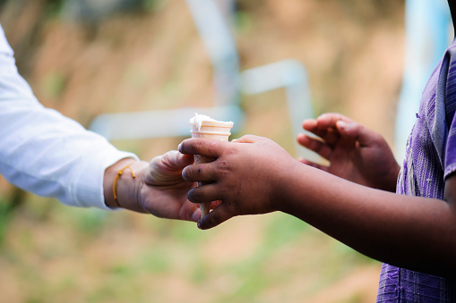

# UAS-3 My Innovations

**Judul: The "Empowerment Ecosystem": Mengubah Jaring Pengaman Menjadi Landasan Peluncuran**

## I. Latar Belakang: Kegagalan Model Lama
Selama puluhan tahun, dunia menggunakan model "Jaring Pengaman Sosial" (*Social Safety Net*) untuk menangani kemiskinan. Filosofinya adalah: "Jika mereka jatuh, kita tangkap." Namun, data membuktikan model ini gagal. Mengapa? Karena jaring hanya mencegah orang mati kelaparan, tapi tidak membuat mereka bisa berjalan sendiri. Akibatnya, tercipta **Dependency Syndrome** (Sindrom Ketergantungan).

Inovasi yang saya tawarkan adalah pergeseran radikal dari *Safety Net* menjadi **"Launchpad" (Landasan Peluncuran)**. Saya menyebut sistem ini **"The Empowerment Ecosystem"**.

## II. Arsitektur Sistem 3-E (The 3-E Framework)

Sistem ini bukan sekadar aplikasi, melainkan **rekayasa sosial-ekonomi** yang mengintegrasikan tiga pilar krusial yang selama ini berjalan sendiri-sendiri:

### 1. Education: Contextual Micro-Credentials (*The Software*)
Sistem pendidikan konvensional seringkali tidak relevan bagi masyarakat miskin (misal: belajar sejarah Eropa padahal butuh teknik pertanian).

* **Inovasi:** "Sekolah Vokasi Berbasis Aset Lokal".
* **Mekanisme:** Kurikulum disusun berdasarkan potensi daerah. Jika daerah pesisir, kurikulumnya adalah "Teknologi Pengawetan Ikan & Navigasi Digital".
* **Teknologi:** Menggunakan modul *Micro-Learning* offline (untuk daerah minim sinyal) yang mengajarkan *skill* praktis bernilai ekonomi tinggi dalam waktu singkat.

### 2. Economy: Social Collateral Finance (*The Fuel*)
Bank tidak mau meminjamkan uang ke orang miskin karena "Risiko Tinggi" dan "Tanpa Agunan". Rentenir masuk mengisi kekosongan ini dengan bunga mencekik.

* **Inovasi:** "Pembiayaan Berbasis Kepercayaan Sosial".
* **Mekanisme:** Mengadopsi dan memodifikasi model *Grameen Bank*. Peminjam wajib membentuk kelompok (5 orang). Jika satu gagal bayar, semua menanggung. Ini menciptakan *Social Pressure* yang positif untuk saling menjaga.
* **Fitur Baru:** *Asset-Locking Capital*. Uang pinjaman tidak dicairkan tunai (agar tidak dipakai beli rokok/pulsa), melainkan langsung dibelikan **Aset Produktif** (bibit, mesin jahit, alat pertukangan) oleh sistem.

### 3. Equity: Digital Cooperative Marketplace (*The Road*)
Orang miskin seringkali memproduksi barang bagus, tapi keuntungan mereka habis dimakan tengkulak (*middlemen*).

* **Inovasi:** "Koperasi Digital Terdesentralisasi".
* **Mekanisme:** Sebuah platform *marketplace* khusus (B2B) yang menghubungkan produsen desa langsung dengan pembeli kota atau pabrik.
* **Transparansi:** Menggunakan sistem pencatatan digital sederhana untuk memastikan harga jual yang diterima petani adalah harga wajar, memotong rantai pasok yang korup.

## III. Mekanisme "The Prosperity Loop"

Berbeda dengan sumbangan yang "putus" setelah diberikan, sistem ini adalah siklus tertutup (*Closed-loop System*):

1.  **Fase Inkubasi:** Peserta masuk, dilatih keterampilan spesifik (Pilar 1).
2.  **Fase Akselerasi:** Peserta lulus tes, mendapatkan modal berupa alat usaha (Pilar 2).
3.  **Fase Produksi & Pasar:** Peserta menghasilkan produk, sistem membantu menjualnya dengan harga adil (Pilar 3).
4.  **Fase Reinvestasi:** Keuntungan dibagi dua: 70% untuk pendapatan rumah tangga, 30% dikembalikan ke sistem untuk membiayai peserta baru.

## IV. Indikator Keberhasilan (Impact Metrics)

Sukses dalam inovasi ini tidak diukur dari "berapa nasi bungkus yang dibagikan", melainkan:

1.  **Graduation Rate:** Berapa persen peserta yang berhasil lepas dari bantuan dalam 2 tahun.
2.  **Income Stability:** Peningkatan pendapatan rata-rata bulanan.
3.  **Asset Ownership:** Jumlah aset produktif yang berhasil dimiliki keluarga secara mandiri.

Kesimpulannya, kemiskinan global adalah masalah sistemik yang membutuhkan solusi sistemik. **The Empowerment Ecosystem** bukan tentang berbuat baik, tapi tentang **membangun sistem yang benar**.

---
**Referensi Model:**
* *Grameen Bank Model (Muhammad Yunus)*
* *Asset-Based Community Development (ABCD)*
* *Platform Cooperativism*